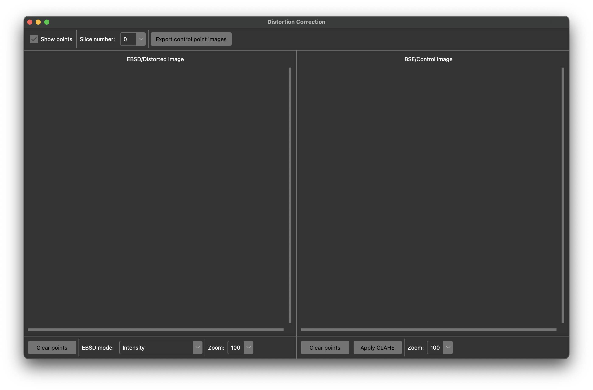

# Distortion correction for EBSD/BSE images

Contains python files for correcting distorted EBSD images using reference BSE images.

**This repository is under development and there may be bugs. Please post an issue or email me (jlamb@ucsb.edu) if something is not working.**

## Usage

To download the code, either run `git clone git@github.com:lambjames18/EBSD-Correction.git` (assuming git is installed) or download the zip file of the repository and unpack it. Once it is downloaded, move into the directory (`cd EBSD-Correction`) and simply run `python ui.py`. The conda environment used during development can be recreated using the following command:

`conda create -n align python numpy matplotlib h5py imageio scipy scikit-learn scikit-image tifffile`

New command for automatic control point IDing:
`conda create -n align python numpy matplotlib h5py imageio scipy scikit-learn scikit-image pytorch torchvision kornia -c pytorch -c conda-forge`

For information about miniconda (the lightweight command line version of anaconda) see https://docs.conda.io/en/latest/miniconda.html. The environment (named "align" in the command above) will need to be activated in order to run the code. Alternatively, any python interpreter can be used as long as the following packages are installed on your computer:

- `python >= 3.8`
- `numpy`
- `matplotlib`
- `h5py`
- `imageio`
- `scipy`
- `scikit-learn`
- `scikit-image`
- `tifffile`

### Initial window

The initial window (above) shows two blank image viewers. These will contiaon the distorted (left) and the control (right) images. The top row is for general functions that are applied to both viewers. The bottom row is specific operations that can be applied to the individual viewers. The top tab (not shown) has "File" and "Apply". These are discussed below.

### Importing data

The "File" tab provides the ability to open data. You will select either 2D or 3D data to import. The differences are minor between the two, but it determines what the code expects from the inputs. Upon clicking the import button, the above interface will be displayed (the 2D version is shown). You are required to select a distorted image and a control image, but the other inputs are optional. The notes underneath the inputs provide more detail about what the code expects. **NOTE: if you have different resolutions between your two data modes (high res BSE, low res EBSD for example) you will need to specify the pixel resolutions in order to correct for the disparity.** If the resolutions are the same, these entries can be left blank.

For 3D data, the distorted file must be a dream3d file and the control image must be the first image of all control images for the volume (no other files in the folder containing the control images, please).

Once you click "Open", a new interface will pop up (below). This provides a summary of the data read in by the code. Here you can opt to flip the control images (useful for TriBeam datasets, this just rotates the control images 180 degrees) and/or crop the control images to a specific ROI. If cropping is selected, a final UI will show that allows you to drag over an ROI selection. The two continue buttons indicate whether or not rescaling should be applied. As stated above, having different resolutions of data WILL NOT WORK. By rescaling the data, the disparity in resolution is removed and the control data is downsampled to match that of the distorted resolution. This is performed automaticaaly using `skimage.transform.rescale` if selected.

At this point you are ready to select control points!

### Selecting control points

Simply click on either image to place a reference point. Make sure that the order of the points is consistent between the two viewers (point 1 on distorted should connect to point 1 on control). Remove points by right cicking on them. The points can be cleared for the current pair of images using the "Clear Points" buttons. The view of the distorted data (typically EBSD data) can be changed using the "EBSD mode" dropdown under the distorted viewer. This allows you to view confidence index, image quality, IPF, color, etc.  The "Zoom" dropdown lets you zoom into either image. The scroll bars next to the viewers allow you to move around the image. Currently the scroll bars are the only way to move around.

For 3D data, the "Slice number" dropdown allows you to scroll through the volume and select control points for various slices.

The "Export control point images" button will save a pair of images that show where the control points are located for the two viewers. This is largely for illustrative purposes. The "View points" checkbutton lets you turn off the point overlays in case they are distracting.

### Viewing the alignment

Under the "Apply" tab, TPS and TPS 3D allow you to view the corrected data in an interactive viewer either in 2D or 3D. 3D is only applicable for 3D data, obviously. A new window will appear with either 2 or 3 scrollbars that allow you to shift between corrected and control images (and the slice number if 3D).

### Saving the data

Under the "File" tab, "Export 2D" will compute the alignment solution and save the corrected data. The first window will be to save the disorted data (corrected). The second window is for saving the control data (press cancel if you do not want to save either one). The outputs will match what one sees in the interaview view. "Export 3D" behaves similar, but it creates a new Dream3D file (based on the user input of the save location) and applies the correction to the data within the new Dream3D file.

**NOTE**: The distorted file is only saved as an image currently. In the future, writing an .ang or .h5 file with the corrected data will be supported, but the current state is only to output individual images. Therefore, if one wanted to apply alignment to Confidence Index and Image Quality, one would have to run "Export 2D" twice, each time with a different EBSD mode selected from the dropdown. **The data type is preserved in the saved image, this means that the preview of the image might look wrong, but reading in the data (python, FIJI, etc.) will show the correct data.** For integer data types, the alignemt requires that they go to a float, so the output transforms the float back into the target data type.

## Other files

- `SIFT.py` is for future plans.
- `core.py` this is the core of the alignment algorithms and is called from `ui.py`.
- `InteractiveView.py` this permits interactive viewing of the solutions.
- `IO.py` this handles importing the data.
- `rescale.py` this allows one to rescale individual images to match resolutions between two images. This is handle within the UI, but if one wants to do it separetly, this script can do that.
- `put_BSE_in_h5.py` this is used to put control images into a Dream3D file.
- `scratch.py` this is my own scratch file for testing random things. It can be ignored.
- "original" this folder contains older scripts that are kept for potential updates.
- "test_data" contains data one can use to test the UI.
- "theme" this contains images and style files for the tkinter GUI and the README file.

## Future plans

Currently overhauling the UI to be more user friendly...

- Adding h5 support for 2D EBSD data
- Adding cropping/rescaling functionality within the UI
- Planning to incorporate automatic control point detection algorithms
- Need to integrate the ability to have multiple control images for each distorted image (imagine toggling between BSE and SE images)
- Plenty of other things...
